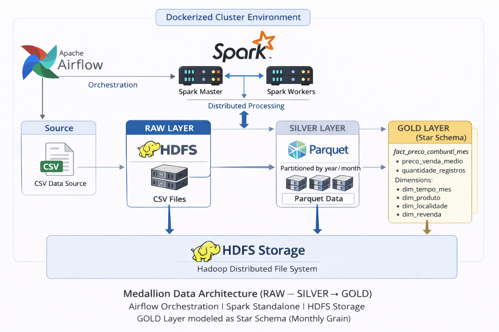

# Medallion Data Pipeline — Airflow, Spark & HDFS

Pipeline de **Engenharia de Dados** baseado na arquitetura **Medallion (RAW → SILVER → GOLD)**, utilizando **Apache Airflow** para orquestração, **Apache Spark (Standalone)** para processamento distribuído e **HDFS** como camada de armazenamento.

O objetivo do projeto é demonstrar, de forma prática, competências essenciais para a função de **Data Engineer**, incluindo ingestão, transformação, orquestração, governança básica de dados e execução em ambiente containerizado.

---

## Visão Geral da Arquitetura

- **Orquestração**: Apache Airflow  
- **Processamento**: Apache Spark (Standalone Cluster)  
- **Armazenamento**: Hadoop HDFS  
- **Infraestrutura**: Docker Compose  
---
O pipeline segue o padrão Medallion (RAW → SILVER → GOLD), utilizando
Apache Airflow para orquestração, Apache Spark para processamento distribuído
e HDFS como camada de armazenamento.

### Diagrama da Arquitetura


---
**Fluxo de dados:**
```bash
Fonte CSV
   ↓
RAW  (HDFS / CSV)
   ↓
SILVER (HDFS / Parquet / Particionado)
   ↓
GOLD (HDFS / Parquet / Agregado)
```
---

## Estrutura do Repositório

```bash
Medallion-pipeline/
├── docs/
│   └── architecture_diagram.png
└── airflow-project/
    ├── dags/
    │   └── automotivos_raw_silver_gold.py
    ├── logs/
    │   ├── dag_id=automotivos_raw_silver_gold/
    │   ├── dag_processor_manager/
    │   └── scheduler/
    ├── spark-jobs/
    │   ├── raw_ingest_hdfs.py
    │   ├── silver_transform_automotivos.py
    │   ├── gold_aggregate_automotivos.py
    │   └── dados/
    │       └── precos_semestrais_automotivos_2025_01.csv
    ├── docker-compose.yml
    └── Dockerfile
 ```
---
# Camadas de Dados (Medallion Architecture)
## RAW
- Ingestão direta de dados CSV no HDFS
- Dados preservados no formato original
- Escrita distribuída via Spark
- Sem tratamento ou validação

### Exemplo de path:
```bash
/user/airflow/raw/orders/automotivos
```
---
## SILVER
- Limpeza e padronização dos dados
- Conversão de tipos (datas, valores numéricos)
- Escrita em formato Parquet
- Particionamento por ano (year)
- Dados prontos para análises exploratórias
### Exemplo de path:
```bash
/user/airflow/silver/automotivos/year=2025
```
---
## GOLD
- Agregações e métricas consolidadas
- Dados prontos para consumo analítico / BI
- Escrita em Parquet particionado
- Foco em performance e clareza semântica
### Exemplo de path:
```bash
/user/airflow/gold/automotivos/year=2025
```
---

## Orquestração com Airflow
- DAG única responsável por todo o fluxo RAW → SILVER → GOLD
- Execução via SparkSubmitOperator
- Spark executando em modo Standalone (spark://spark-master:7077)
- Separação clara entre:
- Orquestração (Airflow DAG)
- Processamento (jobs PySpark)
- Logs centralizados no Airflow para auditoria e troubleshooting

---
## Execução do Projeto
### Subir o ambiente
```bash
docker compose up -d
```
### Airflow Web UI
- URL: http://localhost:8080
- Usuário: admin
- Senha: admin

### Execução da DAG
- DAG: automotivos_medallion_dag
- Execução manual via interface do Airflow

### Dataset
O dataset bruto utilizado neste projeto não é versionado no repositório devido a restrições de tamanho.

Espera-se que ele esteja disponível localmente no seguinte caminho:
```bash
airflow-project/spark-jobs/dados/
```
### Fonte:
ANP – Agência Nacional do Petróleo, Gás Natural e Biocombustíveis
Preços de Combustíveis (Brasil)

### Considerações Técnicas Relevantes
- Spark executando em modo Standalone, simulando ambiente distribuído
- Conexão spark_default configurada para:
```bash
spark://spark-master:7077
```
- Persistência de dados no HDFS com controle de permissões
- Diretórios HDFS criados previamente para evitar AccessControlException
- Uso de Parquet nas camadas SILVER e GOLD para otimização de I/O
- Escrita idempotente (overwrite) nas execuções
- Pipeline validado com _SUCCESS em todas as camadas
- Ambiente totalmente reproduzível via Docker
- ---

### Tecnologias Utilizadas
Apache Airflow 2.x

Apache Spark 3.4.x (PySpark)

Hadoop HDFS

Docker & Docker Compose

Python

---

#### Autor 
Daniel Lima Viana

